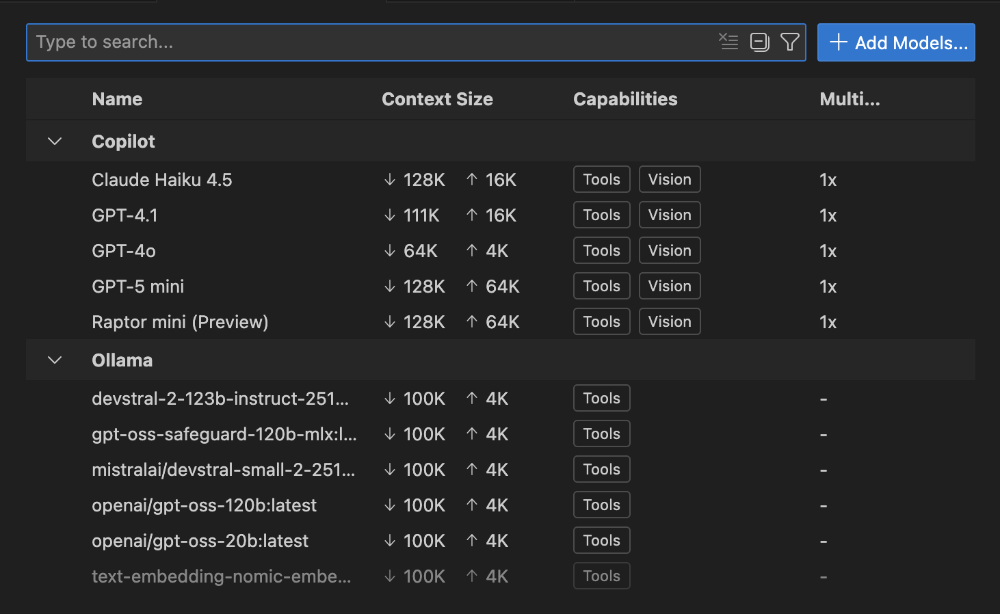
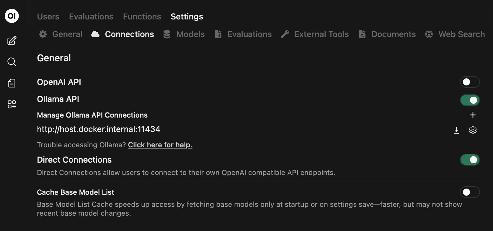
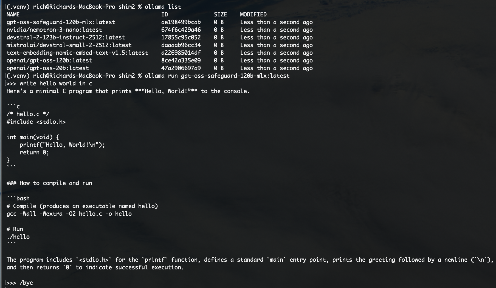

# LMStudio Ollama VSCode Shim

[FastAPI](https://github.com/fastapi/fastapi) server that exposes an [Ollama](https://ollama.com)-compatible API proxying requests to a
running [LM Studio](https://lmstudio.ai) instance, such that the Ollama Language Model extension can be
used in [Visual Studio Code](https://code.visualstudio.com) and [Co-Pilot](https://github.com/copilot), with LM Studio (server) hosted models - as seen [below](README.md#LM-Studio-Available-Models).

More details on the implementation can be seen at [DETAIL.md](DETAIL.md).

*Note - as this is an Ollama server compatible API, this can also be used for other clients and tools, 
like [Open-WebUI](https://openwebui.com), and even the [Ollama CLI](https://docs.ollama.com/cli) (limited API support)  - as seen [below](README.md#OpenWebUI-Configuration).*

## Why?

I was working on my Mac over the holidays, testing out local LLM execution and use.
I decided I wanted to use LM Studio mostly, due to the [MLX](https://opensource.apple.com/projects/mlx/) models, but I could not
make them work with Co-Pilot in VSCode.  Not liking other plugins or solutions,
I built this.

*Note - this program was created for my personal usage and needs, on a Macbook Pro (14-inch, Nov 2024) - Chip: Apple M4 Max, Ram: 128GB*

## Quick start

```bash
# Python 3.11.11 was used in development of this project
python -m venv .venv
source .venv/bin/activate
pip install -r requirements.txt
python main.py
```

OpenAPI docs are available at `http://localhost:11434/docs`.

## Configuration

Environment variables:
- `SHIM_LMSTUDIO_BASE`: Base URL for LM Studio (default: `http://localhost:1234/v1`).
- `SHIM_LMSTUDIO_REST_BASE`: Optional REST base URL override (default: derived from `SHIM_LMSTUDIO_BASE`).
- `SHIM_HTTP_TIMEOUT`: Request timeout in seconds. Use `0` for no limit, `>= 0.1` otherwise (default: `300`).
- `SHIM_DEBUG`: Set to `1` for debug logging (default: `0`).
- `SHIM_ALLOWED_ORIGINS`: Comma-separated list of allowed CORS origins (default: `http://localhost,http://127.0.0.1`). If empty, CORS middleware allows no origins.
- `SHIM_OLLAMA_VERSION`: Reported Ollama version header (default: `0.13.5`).
- `SHIM_API_KEY`: If set, require `Authorization: Bearer <key>` for non-health endpoints.
- `SHIM_DEFAULT_TTL_SECONDS`: Default TTL injected when keep_alive is not provided (default: `0`).
- `SHIM_UNLOAD_TTL_SECONDS`: TTL to use when keep_alive requests immediate unload (default: `0`, disabled).
- `SHIM_MAX_CONNECTIONS`: Max total backend connections (default: `50`).
- `SHIM_MAX_KEEPALIVE_CONNECTIONS`: Max keepalive connections (default: `20`).
- `SHIM_REQUEST_RETRIES`: Retry count for transient backend failures (default: `1`).
- `SHIM_REQUEST_RETRY_BACKOFF`: Base retry backoff seconds (default: `0.25`).
- `SHIM_VERIFY_SSL`: Verify TLS certs for backend calls (default: `true`).
- `SHIM_MAX_REQUEST_BYTES`: Reject requests above this size (default: unset).
- `SHIM_MODEL_CACHE_TTL_SECONDS`: Cache TTL for model list responses (default: `30`).
- `SHIM_STREAM_CHUNK_SIZE`: Streaming chunk size in bytes (default: `8192`).
- `SHIM_MODEL_SELECTOR_CACHE_SIZE`: Max cached model name resolutions (default: `256`).
- `SHIM_DEFAULT_TEMPERATURE`: Default temperature for generation requests (default: `0.8`).
- `SHIM_DEFAULT_SYSTEM_PROMPT`: Default system prompt for `/api/chat` when not provided.
- `SHIM_DEFAULT_STOP`: Default stop value for completion requests when not provided.
- `SHIM_HOST`: Host interface to bind (default: `0.0.0.0`).
- `SHIM_PORT`: Port to bind (default: `11434`).
- `SHIM_WORKERS`: Uvicorn worker count (default: `1`).
- `SHIM_DISABLE_UVLOOP`: Set to `1` to disable uvloop even if installed.

## Run locally

Configure environment and install dependencies:

```bash
# Python 3.11.11 was used in development of this project
python -m venv .venv
source .venv/bin/activate
pip install -r requirements.txt
```

Then run:

```bash
python main.py
```

Module entry point:

```bash
python -m shim.main
```

## VS Code usage

Point VS Code extensions that expect an Ollama server to this shim (default
port `11434`). The shim forwards requests to LM Studio via `SHIM_LMSTUDIO_BASE`.

## Tests

To run all available tests:

```bash
pytest
```

## Format, Lint, Type Check

Ruff:

```bash
ruff check
```

PyLint:

```bash
pylint $(find . -type f -name '*.py' \
  ! -path '*/__pycache__/*' \
  ! -path '*/.pytest_cache/*' \
  ! -path '*/.mypy_cache/*' \
  ! -path '*/.ruff_cache/*' \
  ! -path '*/.venv/*')
```

MyPy:

```bash
files=("${(@f)$(find . \( -path './.venv' -o -path './.venv/*' -o -path './.git' -o -path './.git/*' -o -path '*/__pycache__' -o -path '*/__pycache__/*' -o -path '*/.pytest_cache' -o -path '*/.pytest_cache/*' -o -path '*/.mypy_cache' -o -path '*/.mypy_cache/*' -o -path '*/.ruff_cache' -o -path '*/.ruff_cache/*' \) -prune -o -type f -name '*.py' -print)}"); mypy --strict "${files[@]}"
```

## Docker

To build the docker image:

```bash
docker build -t shim:latest .
```

To run the docker image:

```bash
docker run -p 11434:11434 -d shim:latest
```

## Screenshots

### LM Studio Available Models


### Models appearing in VSCode Language Model Selector


### Models appearing in VSCode Chat Window Model Selector


### Shim Process Output


### OpenWebUI Configuration


### OpenWebUI Model Selector


### Ollama CLI


## TODO

- Increase test coverage
- Split out backend code for maintainability
- Update to a modern setup/config system with toml
