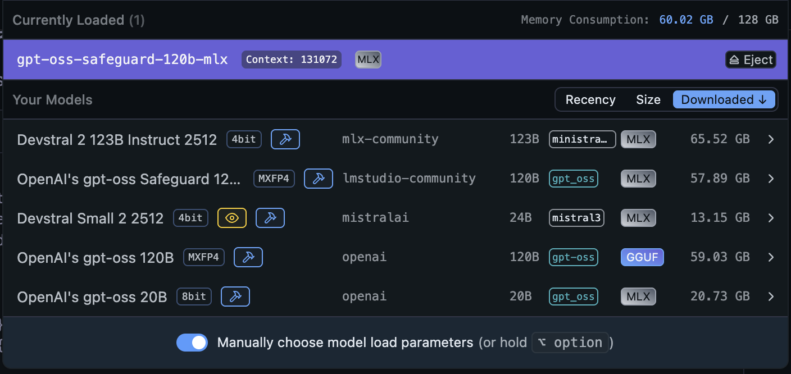
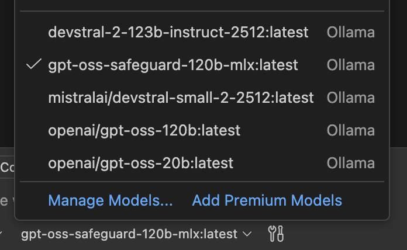
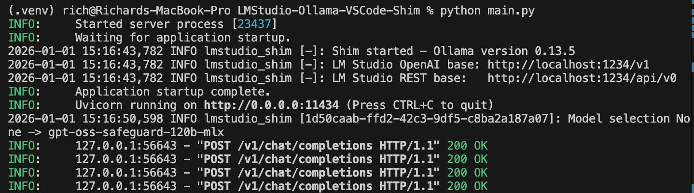

# LMStudio Ollama VSCode Shim

FastAPI server that exposes an Ollama-compatible API proxying requests to a
running LM Studio instance, such that the Ollama Language Model extension can be
used in Visual Studio Code with Co-Pilot.

## Why?

I was working on my Mac over the holidays, testing out local LLM execution and use.
I decided I wanted to use LM Studio mostly, due to the MLX models, but I could not
make them work with Co-Pilot in VSCode.  Not liking other plugins solutions,
I built this.

## Quick start

```bash
python -m venv .venv
source .venv/bin/activate
pip install -r requirements.txt
uvicorn main:app --reload --host 0.0.0.0 --port 11434
```

## Configuration

Environment variables:
- `SHIM_LMSTUDIO_BASE`: Base URL for LM Studio (default: `http://localhost:1234/v1`).
- `SHIM_LMSTUDIO_REST_BASE`: Optional REST base URL override (default: derived from `SHIM_LMSTUDIO_BASE`).
- `SHIM_HTTP_TIMEOUT`: Request timeout in seconds. Use `0` for no limit (default: `300`).
- `SHIM_DEBUG`: Set to `1` for debug logging (default: `0`).
- `SHIM_ALLOWED_ORIGINS`: Comma-separated list of allowed CORS origins (default: empty).
- `SHIM_OLLAMA_VERSION`: Reported Ollama version header (default: `0.13.5`).
- `SHIM_API_KEY`: If set, require `Authorization: Bearer <key>` for non-health endpoints.
- `SHIM_DEFAULT_TTL_SECONDS`: Default TTL injected when keep_alive is not provided (default: `0`).
- `SHIM_UNLOAD_TTL_SECONDS`: TTL to use when keep_alive requests immediate unload (default: `1`).
- `SHIM_HOST`: Host interface to bind (default: `0.0.0.0`).
- `SHIM_PORT`: Port to bind (default: `11434`).

## Run locally

Configure environment and install dependencies:

```bash
python -m venv .venv
source .venv/bin/activate
pip install -r requirements.txt
```

Then run:

```bash
uvicorn main:app --reload
```

Or run directly:

```bash
python main.py
```

## VS Code usage

Point VS Code extensions that expect an Ollama server to this shim (default
port `11434`). The shim forwards requests to LM Studio via `SHIM_LMSTUDIO_BASE`.

## Tests

Run the health check test:

```bash
pytest
```

## Screenshots

LM Studio Available Models


Models appearing in VSCode Language Model Selector


Models appearing in VSCode Chat Window Model Selector


Shim Process Output

